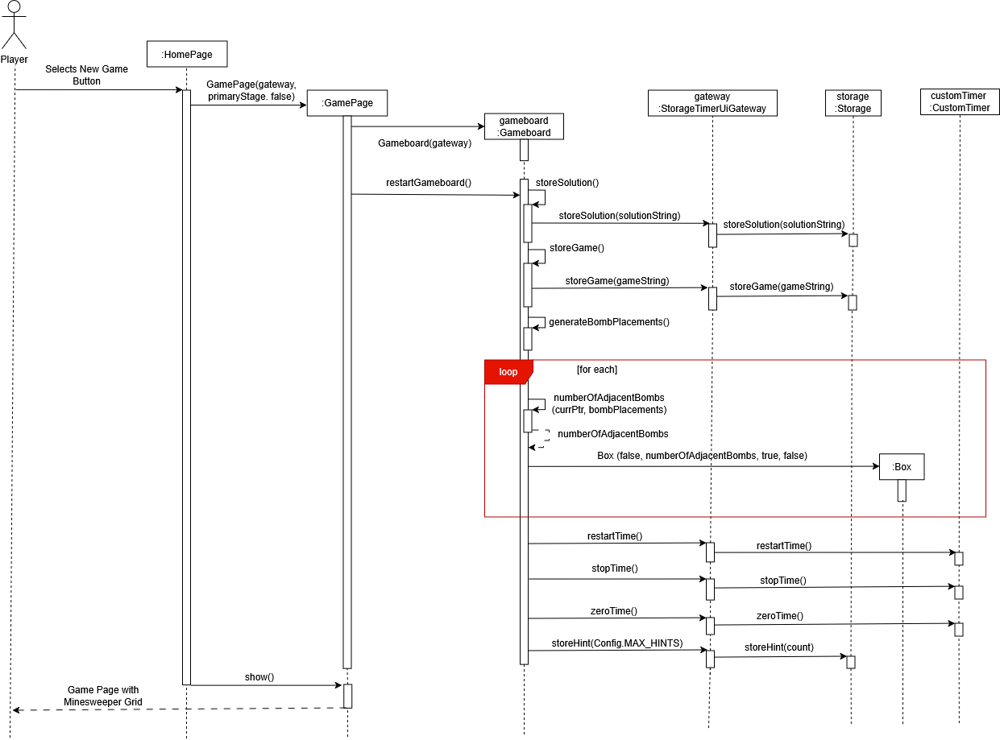
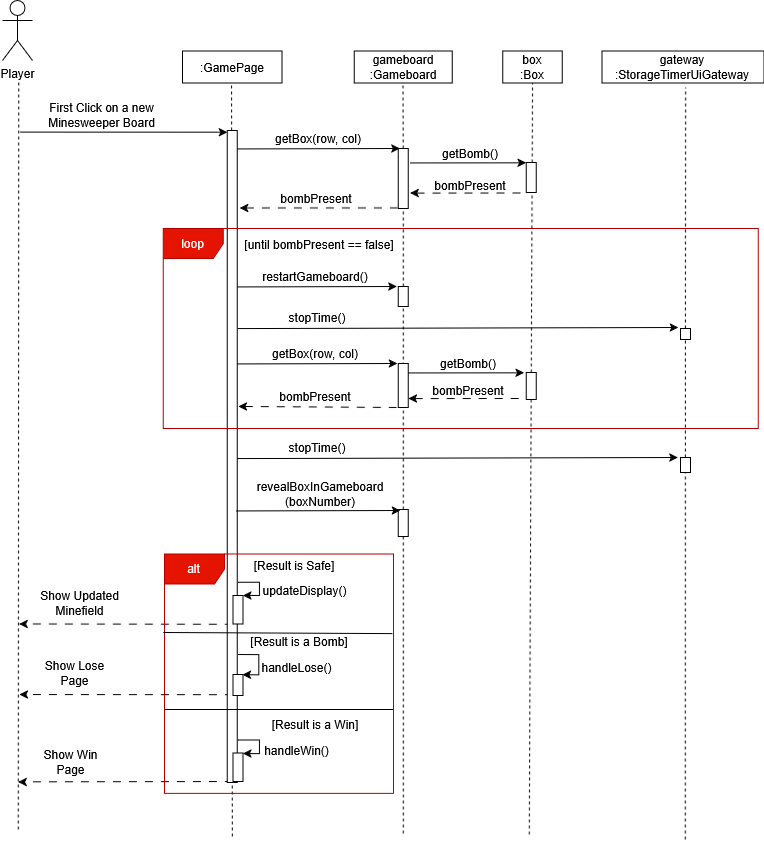
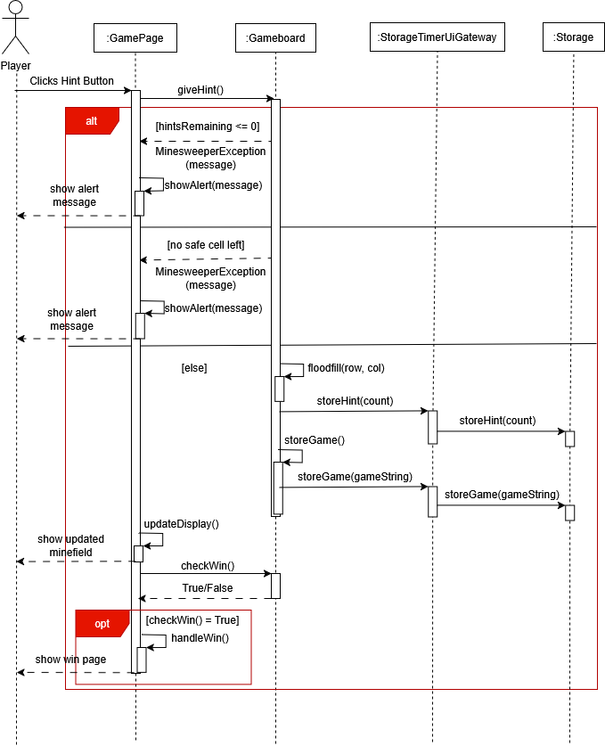
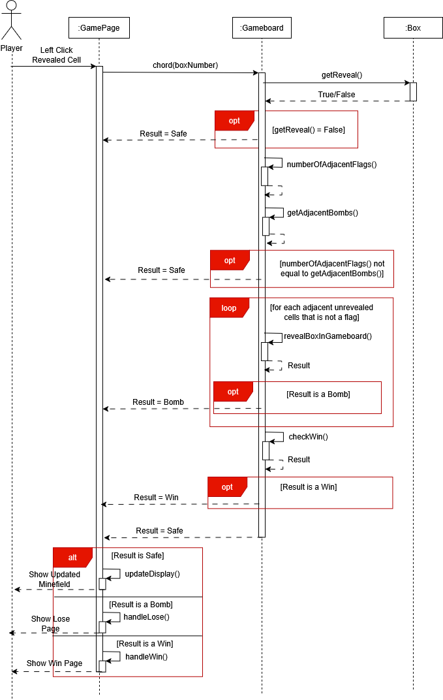
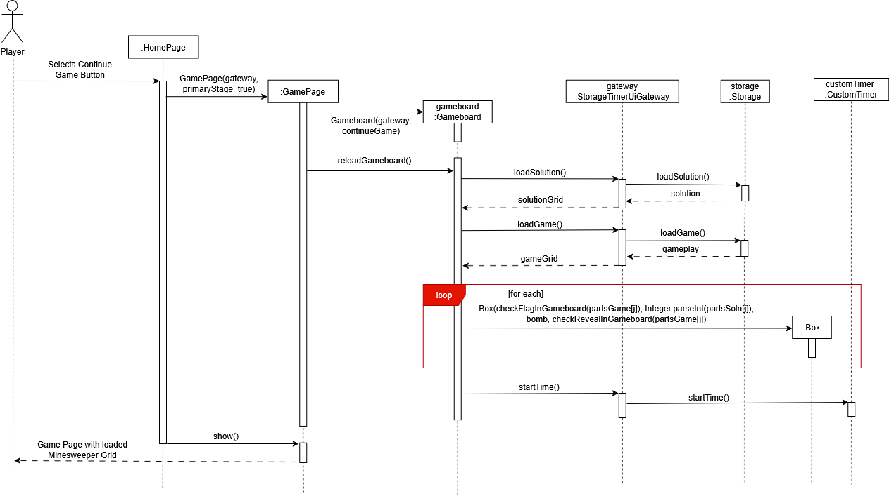

# Minesweeper — Developer's Guide

[User Guide](./USER_GUIDE.md) | [Developer's Guide](#)

---

## 1. Acknowledgements

| Library | Version | Purpose |
|---------|---------|---------|
| [JavaFX](https://openjfx.io/) | 21 | GUI framework |
| [JUnit 5](https://junit.org/junit5/) | 5.x | Unit testing |
| [Mockito](https://site.mockito.org/) | 5.x | Mocking in unit tests |
| [Gradle Shadow](https://github.com/johnrengelman/shadow) | 8.x | Fat JAR packaging |

---

## 2. Setting Up

### Prerequisites

- Java 21+
- JavaFX 21 (bundled via Gradle)
- Git

### Cloning the Repository

```bash
git clone https://github.com/tPJustinCheran/minesweeper.git
cd minesweeper
```

### Running the Application

```bash
./gradlew run
```

### Building the JAR

```bash
./gradlew shadowJar
```

Output file: `build/libs/minesweeper.jar`

```bash
java -jar build/libs/minesweeper.jar
```

### IDE Setup (IntelliJ IDEA)

1. Open IntelliJ → File → Open → select the `minesweeper` folder
2. IntelliJ will detect the Gradle build file automatically
3. Wait for Gradle sync to complete
4. Run `minesweeper.ui.HomePage` as the main class, or use `./gradlew run`

### Running Tests

```bash
./gradlew test
```

---

## 3. Design

### Architecture Overview

The application is divided into three packages following a strict layered architecture:

```
minesweeper.ui  →  minesweeper.logic  →  minesweeper.storage
```

- The **UI layer** only interacts with the **Logic layer**
- The **Logic layer** interacts with the **Storage layer**
- The **UI layer** never imports or calls `Storage` directly

This is enforced via the `StorageTimerUiGateway` class in `minesweeper.logic`, which acts as the single entry point for all storage and timer operations. UI classes receive a `StorageTimerUiGateway` object and call it for any data persistence or time tracking needs.

`Insert architecture diagram here`

### Design Decisions

**Gateway pattern:** One facade in logic keeps UI fully decoupled from storage concerns.

**Layered architecture over MVC:** JavaFX blurs MVC boundaries; three layers are simpler and more testable.

**File-based storage over database:** Five small files need no database, are zero dependency, human readable, and portable.

---

### Package: minesweeper.logic

#### `Gameboard`

**Purpose:** Central class managing the 10x10 grid of `Box` objects and all game logic.

**Key Fields:**

| Field | Type | Description |
|-------|------|-------------|
| `gameboard` | `Box[][]` | The 10x10 grid of cells |
| `hintsRemaining` | `int` | Number of hints left this game |
| `gateway` | `StorageTimerUiGateway` | Single entry point for storage and timer |

**Key Behaviours:**
- Generates and stores bomb placements on new game
- Flood fill reveals connected empty cells recursively
- Hint system reveals a random safe unrevealed unflagged cell
- Chording auto-reveals adjacent cells when flag count matches cell number
- Win detection checks if all non-bomb cells are revealed
- Persists game state via `StorageTimerUiGateway` after every move

**Constructors:**
- `Gameboard(gateway)` creates a new game, generates a random board and stores it to disk
- `Gameboard(gateway, isContinue)` loads a saved board from disk via the gateway

---

#### `Box`

**Purpose:** Represents a single cell on the gameboard.

**Key Fields:**

| Field | Type | Description |
|-------|------|-------------|
| `bomb` | `boolean` | Whether this cell is a bomb |
| `adjacentBombs` | `int` | Number of adjacent bombs (0 if bomb cell) |
| `reveal` | `boolean` | Whether this cell has been revealed |
| `flag` | `boolean` | Whether this cell has been flagged |

**Key Behaviours:**
- Simple data class with getters and setters
- `solutionDisplay()` returns the string representation used when writing to `solution.txt`

---

#### `CustomTimer`

**Purpose:** Tracks elapsed game time in milliseconds using `System.currentTimeMillis()`.

**Key Fields:**

| Field | Type | Description |
|-------|------|-------------|
| `startTimeMillis` | `long` | System time when timer last started |
| `offsetMillis` | `long` | Accumulated time from previous sessions |
| `timerRunning` | `boolean` | Whether the timer is currently running |

**Key Behaviours:**
- `startTime()` begins or resumes tracking
- `stopTime()` pauses tracking
- `restartTime()` resets and starts from zero
- `zeroTime()` resets offset to zero without starting
- `pauseAndStopTime()` saves current time to `time.txt` and stops
- `displayTimeMinSecs()` returns a formatted string in `MM:SS.mmm` format

---

#### `StorageTimerUiGateway`

**Purpose:** Bridge between the UI layer and `Storage`/`CustomTimer`. Lives in `minesweeper.logic` so UI classes only need to import from the logic package.

**Key Fields:**

| Field | Type | Description |
|-------|------|-------------|
| `storage` | `Storage` | Handles all file I/O |
| `customTimer` | `CustomTimer` | Handles time tracking |

**Key Behaviours:**
- Wraps all `Storage` method calls including store and load for game, solution, hint, time, and leaderboard
- Wraps all `CustomTimer` method calls including start, stop, restart, zero, and display
- `hasExistingSave()` checks if `game.txt` and `solution.txt` exist and are readable

---

### Package: minesweeper.storage

#### `Storage`

**Purpose:** Handles all file I/O. Reads and writes to the `data/` directory adjacent to the JAR.

**Key Fields:**

| File | Purpose |
|------|---------|
| `game.txt` | Current board state (`R`/`F`/`N` per cell) |
| `solution.txt` | Bomb positions and adjacent counts |
| `time.txt` | Elapsed time in milliseconds |
| `hint.txt` | Remaining hint count |
| `leaderboard.txt` | Sorted leaderboard entries (`name|timeMillis` per line) |

**Key Behaviours:**
- `onStartup()` checks that the `data/` directory and all required files exist, creating them if not
- Leaderboard entries are stored sorted by time ascending
- All methods throw `StorageException` on file read or write failure

---

#### `Config`

**Purpose:** Constants class holding all game configuration values. Accessible across all layers since it contains no behaviour.

**Key Fields:**

| Constant | Value | Description |
|----------|-------|-------------|
| `APP_VERSION` | `"v0.8"` | Displayed in UI title and version label |
| `DEBUG_MODE` | `false` | Enables Win debug button when `true` |
| `BOARD_SIZE_ROW` | `10` | Grid rows |
| `BOARD_SIZE_COL` | `10` | Grid columns |
| `MIN_BOMBS` | `5` | Minimum bombs per game |
| `MAX_BOMBS` | `20` | Maximum bombs per game |
| `MAX_HINTS` | `3` | Hints allowed per game |

---

### Package: minesweeper.ui

#### `HomePage`

**Purpose:** JavaFX application entry point and main navigation hub.

**Key Fields:**

| Field | Type | Description |
|-------|------|-------------|
| `gateway` | `StorageTimerUiGateway` | Created fresh on each start |
| `hasExistingSave` | `boolean` | Controls whether Continue button is enabled |

**Key Behaviours:**
- Creates a new `StorageTimerUiGateway` on each `start()` call
- Disables Continue button if no valid save exists
- Displays version label at bottom left from `Config.APP_VERSION`

**Navigation:** GamePage, LeaderboardPage, HelpPage

---

#### `GamePage`

**Purpose:** Main game screen managing the grid, timer, bomb counter, and all player interactions.

**Key Fields:**

| Field | Type | Description |
|-------|------|-------------|
| `cellButtons[][]` | `Button[][]` | 2D array of buttons mapped to the grid |
| `isFirstClick` | `boolean` | Guards first click safety and timer start |
| `timerTimeline` | `Timeline` | Polls `gateway.displayTimeMinSecs()` every 50ms |
| `bombCountLabel` | `Label` | Displays `totalBombCount - flagCount` |
| `hintBtn` | `Button` | Displays remaining hints |

**Key Behaviours:**
- Left click on unrevealed cell calls `revealBoxInGameboard()`
- Left click on revealed cell calls `chord()`
- Right click on unrevealed cell calls `setFlagInGameboard()`
- Right click on revealed cell does nothing

**Navigation:** WinPage, LosePage, HomePage

---

#### `WinPage`

**Purpose:** Modal dialog for name entry and leaderboard submission on win.

**Key Fields:**

| Field | Type | Description |
|-------|------|-------------|
| `gateway` | `StorageTimerUiGateway` | Used to call `addEntry()` |
| `finalTime` | `String` | Formatted time string to display |
| `timeMillis` | `long` | Raw time in milliseconds to save |
| `onClose` | `Runnable` | Callback to reset board after submission |

**Key Behaviours:**
- Validates name, rejects names containing `|` and defaults to `Anonymous` if empty
- Calls `gateway.addEntry()` then opens `LeaderboardPage.showAndWait()`
- Runs `onClose` callback after leaderboard is closed to reset the board

**Navigation:** LeaderboardPage, HomePage

---

#### `LosePage`

**Purpose:** Modal dialog shown on loss with Play Again and Back to Home options.

**Key Fields:**

| Field | Type | Description |
|-------|------|-------------|
| `finalTime` | `String` | Displayed completion time |
| `bombsNotFlagged` | `int` | Displayed unflagged bomb count |
| `onPlayAgain` | `Runnable` | Callback to restart the board |
| `onHomeButton` | `Runnable` | Callback to clear save and go home |

**Key Behaviours:**
- Displays time and unflagged bomb count on loss
- X button defaults to Play Again behaviour

**Navigation:** GamePage (play again), HomePage

---

#### `LeaderboardPage`

**Purpose:** Modal window displaying ranked completion times.

**Key Fields:**

| Field | Type | Description |
|-------|------|-------------|
| `gateway` | `StorageTimerUiGateway` | Used to call `loadLeaderboard()` |
| `leaderboardStage` | `Stage` | The leaderboard window |
| `onClose` | `Runnable` | Callback run when leaderboard is closed |

**Key Behaviours:**
- Loads entries via `gateway.loadLeaderboard()`
- Top 3 entries rendered with gold, silver, bronze row styling
- Supports `show()` for non-blocking display and `showAndWait()` for blocking display, the latter used from `WinPage`

**Navigation:** HomePage

---

#### `HelpPage`

**Purpose:** Modal window displaying game instructions from `resources/help.txt`.

**Key Fields:**

| Field | Type | Description |
|-------|------|-------------|
| `resourceManager` | `ResourceManager` | Used to load help text and icon |

**Key Behaviours:**
- Parses lines written in full uppercase as section headers
- Renders each section as a styled card with an emoji
- Contains no game state interaction

**Navigation:** Closes on Home button click.

---

#### `ResourceManager`

**Purpose:** Utility class that loads static image and text assets from the `resources/` folder.

**Key Fields:** Icon path constants including `APP_ICON`, `BOMB_ICON`, `FLAG_ICON`, `WIN_PAGE_ICON`, `LOSE_PAGE_ICON`, `LEADERBOARD_PAGE_ICON`, `HELP_PAGE_ICON`, and `HELP_FILE_NAME`.

**Key Behaviours:**
- Returns `null` on `IOException` so the app degrades gracefully without crashing
- All call sites check for `null` before using the asset, falling back to text labels if icons are missing

**Navigation:** N/A, utility class with no navigation.

---

## 4. Error Handling

**Storage (`minesweeper.storage`):**
All file read/write operations in `Storage` throw `StorageException` (a subclass of `MinesweeperException`) on failure. This includes missing files, unreadable directories, and malformed data. `StorageException` propagates up through `StorageTimerUiGateway` to `Gameboard`, and finally to the UI layer where it is caught and shown as an alert dialog. No storage error silently swallows the exception.

**Invalid save files:**
If `game.txt` or `solution.txt` cannot be parsed (e.g. corrupted data, wrong number of rows), `reloadGameboard()` will throw a `MinesweeperException`. `HomePage` catches this via `hasExistingSave()` returning false, disabling the Continue button so the player cannot enter a broken game state.

**Timer edge cases:**
`CustomTimer` reads elapsed time from `time.txt` as a `long`. If the file contains a non-numeric value or a negative number, `Storage.loadTime()` throws a `StorageException` and the timer defaults to zero. This prevents a corrupted time file from crashing the app.

**Resource loading (`minesweeper.ui`):**
`ResourceManager` catches `IOException` on each asset load and returns `null` silently. All call sites check for `null` before using the asset, falling back to text labels if icons are missing. This ensures the app remains playable even if resource files are absent.

---

## 5. Implementation

### New Game

Chording allows a player to left click a revealed numbered cell to auto-reveal all adjacent unrevealed unflagged cells, provided the number of adjacent flags matches the cell's number.

#### New Game Sequence Diagram



If the player has incorrectly flagged a non-bomb cell and chords, the unflagged adjacent bomb will be revealed and the player loses.

---

### First Click Safety

The first cell the player clicks is guaranteed to never be a bomb. This is implemented in `GamePage.handleFirstClick()`:

#### First Click Safety Sequence Diagram



The board is regenerated with a new random bomb layout on each iteration until the clicked cell is safe. The timer is stopped and zeroed on each restart to ensure it only starts once the player has a valid first click.

---

### Hint System

`Gameboard.giveHint()` reveals a random safe cell and flood fills from it:

#### Hint System Sequence Diagram



Flagged cells are excluded from candidates, this prevents a hint from landing on a flagged cell and making it permanently stuck (since `floodfill` would mark it as revealed and right click would then no-op).

---

### Chording

Chording allows a player to left click a revealed numbered cell to auto-reveal all adjacent unrevealed unflagged cells, provided the number of adjacent flags matches the cell's number.

#### Chording Sequence Diagram



If the player has incorrectly flagged a non-bomb cell and chords, the unflagged adjacent bomb will be revealed and the player loses.

---

### Save / Continue Game

**Saving (on every move):**

`Insert Saving Activity Diagram`

**Continuing:**

#### Continue Game Sequence Diagram



The `game.txt` format stores `R` (revealed), `F` (flagged), or `N` (neither) per cell, pipe-delimited per row. The `solution.txt` stores the bomb position (`B`), adjacent bomb count (`1`-`8`), or empty cell (` `).

---

## 6. Class Diagram

`Insert DrawIO export picture of the class diagram`

---

## 7. Testing

### Unit Tests

Unit tests are located in `src/test/java/minesweeper/logic/`.

| Test Class | Coverage |
|------------|----------|
| `GameboardTest` | Bomb placements, adjacent counts, reload, store strings, flag, reveal, win detection, flood fill, unflagged bomb count |
| `ValidateBombPositionTest` | Bomb position validation for centre and corner cells, adjacent bomb count calculation |
| `TimerTest` | Timer start, stop, zero, restart, display formatting |

All tests use Mockito to mock `StorageTimerUiGateway` so no real file I/O occurs during unit testing.

Run tests with:
```bash
./gradlew test
```

### UI Tests

See [UI Testing](./UI_TESTING.md) for the full UI test checklist and recordings.

---

## 8. Functional and Non-Functional Requirements

See [Product Requirements Document](./PRODUCT_REQUIREMENTS.md).