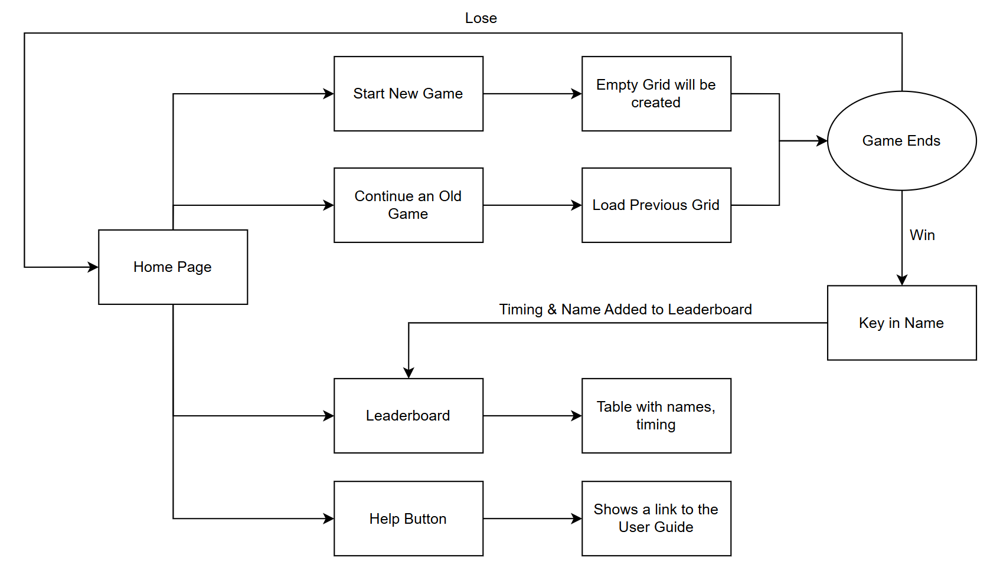

# 📖 Product Requirement Document

## Product Overview 
**Product Vision:** Develop a lightweight, locally-hosted minesweeper game that improves on the classic Windows XP experience. 

**Target Audience:** Solo Players on Windows / macOS / Linux desktops running Java 17+. Suitable for all ages!

**Minimum-Viable Product (MVP):** Fully Playable JavaFX Application with progress saving, a hint system, and a leaderboard. 

*** 
- [Problem](#problem-)
- [Proposed Solution](#proposed-solution)
- [User Flow](#user-flow-)
- [Functional Requirements](#functional-requirements-)
- [Non-Functional Requirements](#non-functional-requirements)
- [Constraints and Limitations](#constraints-and-limitations)

***

## Problem 
- The classic Windows XP Minesweeper has no progress-saving feature — closing the app loses all progress. 
- Standard Minesweeper games offer no hint system, forcing players who are stuck to guess blindly. 
- The Windows XP version has no leaderboard, so completion times cannot be compared across sessions.

## Proposed Solution
Offer a lightweight, desktop-based Minesweeper game built in Java (JavaFX) that addresses the shortcomings 
of the classic version while remaining accessible and easy to play.

Our Unique Selling Points:
- Saves progress automatically on every move and ability to resume exactly where you left off. 
- Provides up to 3 hints per game to assist players who are stuck. 
- Records completion times on a persistent leaderboard sorted by fastest time. 
- First-click safety guarantee. The first cell clicked is never a bomb.

## User Flow 

## Functional Requirements 
|# | Requirement | Priority | Status                | 
|:----|:-----|:----|:----------------------|
|FR-01|Start a new classic minesweeper game / board | Must-Have | <input type="checkbox" checked> | 

(to continue) 

## Non-Functional Requirements

## Constraints and Limitations

