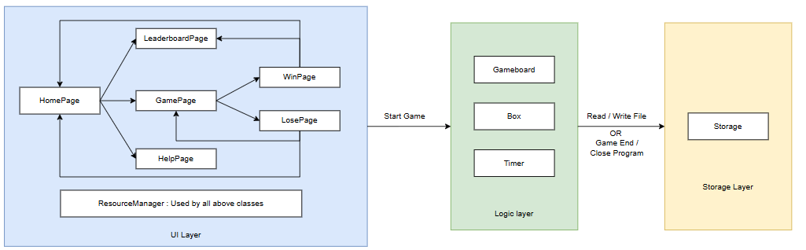
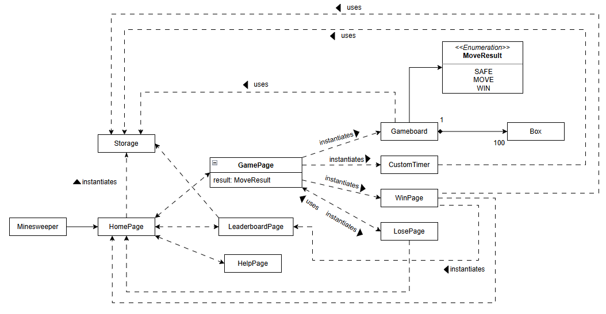
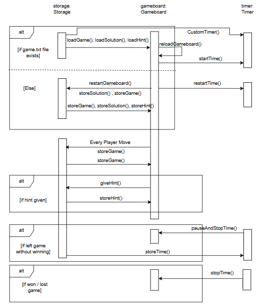

# 📠 System Architecture Document 

## Architecture Overview

| UI Layer                                                                                   | Logic Layer                      | Storage Layer                                                                                                                    | 
|:---------------------------------------------------------------------------------------------|:---------------------------------|:---------------------------------------------------------------------------------------------------------------------------------| 
| HomePage  GamePage HelpPage LeaderboardPage WinPage LosePage ResourceManager | Gameboard Box CustomeTimer| Storage ----------- data/game.txt data/solution.txt data/time.txt data/hint.txt data/leaderboard.txt           |

***

## UML Diagram 

*** 

## Sequence Diagram 
- Gameboard, Storage, Timer Sequential Diagram 

